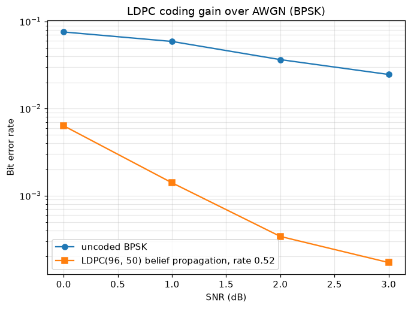
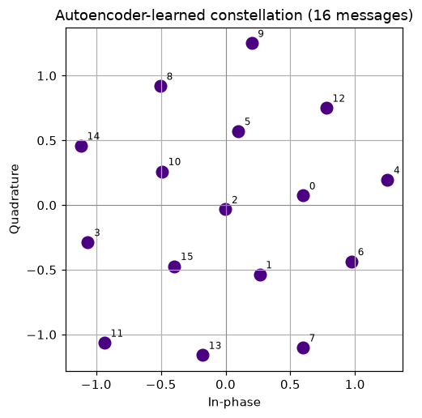
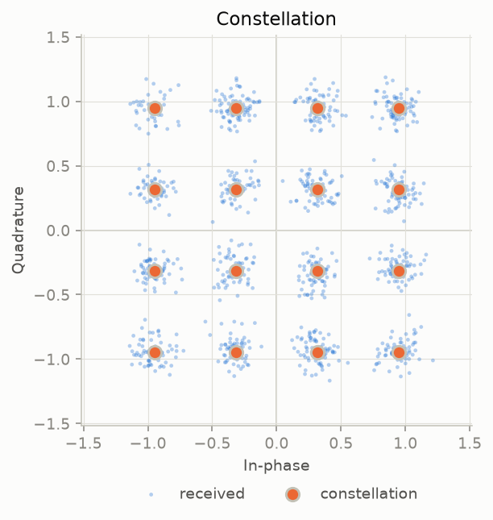
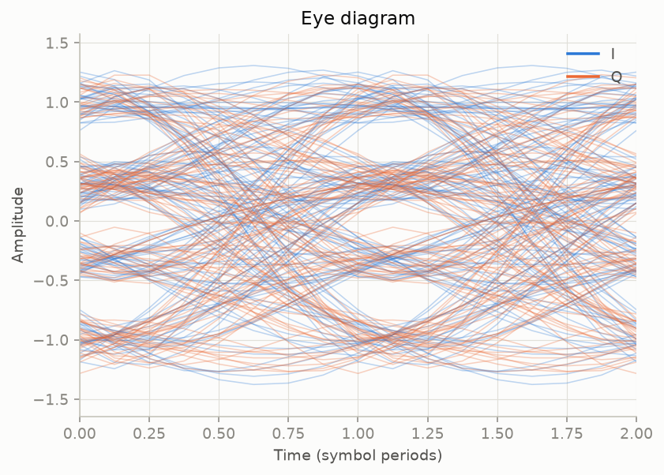
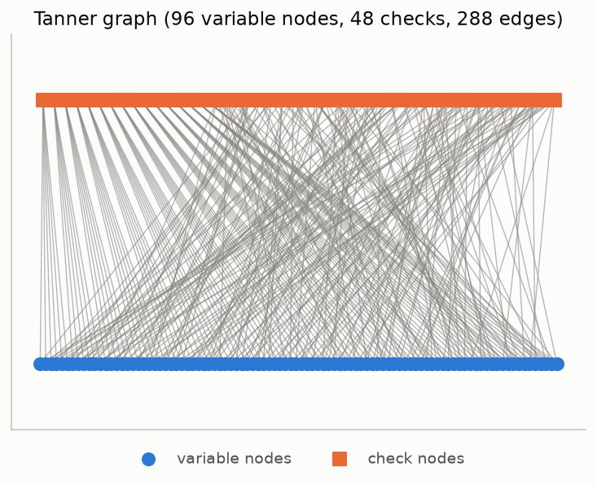
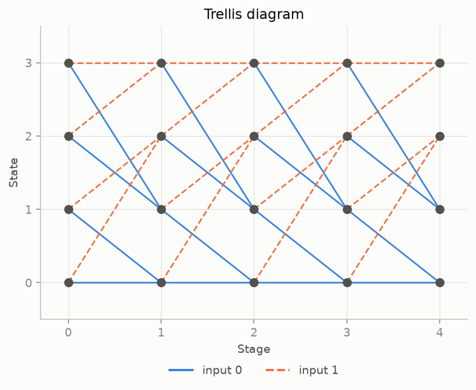
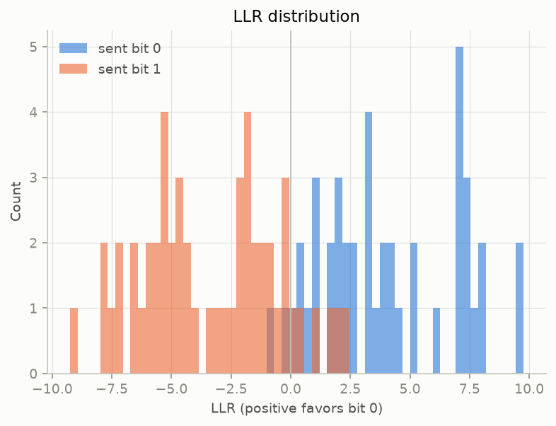
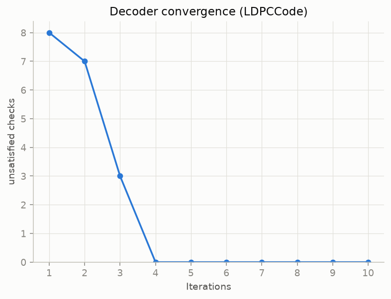
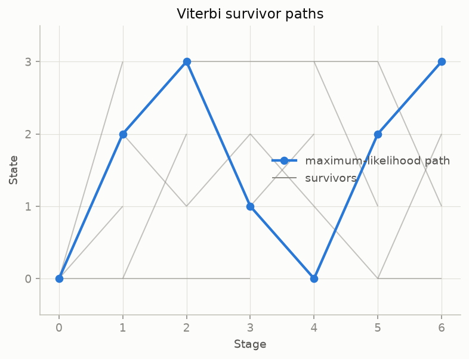
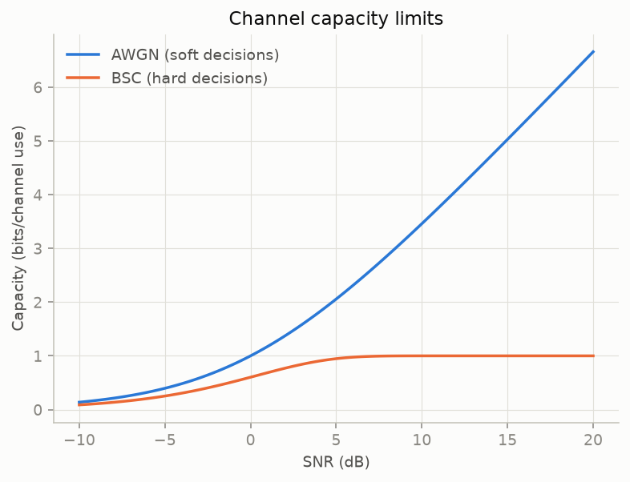

# Gallery

A visual tour of what CommPy produces. Every figure here is generated by a
runnable script in [`examples/`](https://github.com/MarvinElling/CommPy/tree/main/examples).

## Coding gain over AWGN

Forward error correction buys "coding gain": at a given SNR the coded bit-error
rate sits well below the uncoded curve. Here a rate-½ LDPC code
(belief-propagation decoding) over BPSK on an AWGN channel — roughly two orders
of magnitude lower BER than uncoded by 3 dB.



Reproduce and explore:

```python
from commpy import LDPCCode, MPSKModulator, Channels, simulate_coded_ber, plot_waterfall

code = LDPCCode.from_gallager(n=96, w_c=3, w_r=6)
result = simulate_coded_ber(code, MPSKModulator(2), Channels.awgn, [0, 1, 2, 3, 4, 5])
plot_waterfall(result)
```

See [`examples/ldpc_coding_gain_demo.py`](https://github.com/MarvinElling/CommPy/blob/main/examples/ldpc_coding_gain_demo.py),
[`polar_scl_demo.py`](https://github.com/MarvinElling/CommPy/blob/main/examples/polar_scl_demo.py),
and [`turbo_coding_gain_demo.py`](https://github.com/MarvinElling/CommPy/blob/main/examples/turbo_coding_gain_demo.py).

## A constellation learned from scratch

With the optional AI-for-wireless layer (`pip install "commpy[ml]"`), an
autoencoder learns a transmitter and receiver end-to-end by training through a
differentiable channel. Below is the 16-point constellation it discovers for
one complex channel use at 15 dB — no constellation was ever specified.



See [`examples/neural_autoencoder_demo.py`](https://github.com/MarvinElling/CommPy/blob/main/examples/neural_autoencoder_demo.py).

## A constellation, and the decisions around it

`plot_constellation()` draws the reference points, an optional cloud of
received symbols, the Gray bit labels, and the nearest-neighbor decision
regions — the boundaries a hard-decision demodulator actually applies.



```python
from commpy import Channels, MQAMModulator, plot_constellation

mod = MQAMModulator(16)
received = Channels.awgn(mod.modulate(bits), 18.0)
plot_constellation(mod, received=received, labels=True, regions=True)
```

## Where the inter-symbol interference shows

An eye diagram overlays two-symbol windows of the pulse-shaped waveform. The
width of the opening is the timing margin, its height the noise margin.



## The code, drawn

An LDPC code *is* its Tanner graph: variable nodes below, parity checks above,
one edge per one of the parity-check matrix. This is the same adjacency the
belief-propagation decoder walks.



And a convolutional code is its trellis. Input bit 0 is solid, input bit 1
dashed — so the two stay distinguishable in print and under color-vision
deficiency, not only by hue.



## Watching a decoder work

Channel LLRs split cleanly by transmitted bit when the demodulator is
confident. The bit-0 hump sits on the positive side, following the
library-wide convention `L = log(P(0)/P(1))`.



Belief propagation then closes the remaining parity violations over a handful
of iterations.



Viterbi decoding keeps one survivor per state; the maximum-likelihood path is
the one the traceback follows.



## The limits you are working against



The gap between the two curves is the cost of hard decisions: the BSC line is
the capacity a hard-decision BPSK receiver leaves on the table at each SNR.

All nine panels come from
[`examples/visualization_demo.py`](https://github.com/MarvinElling/CommPy/blob/main/examples/visualization_demo.py).
Run it to see them interactively, or with `--save DIR` to regenerate the images
above.
